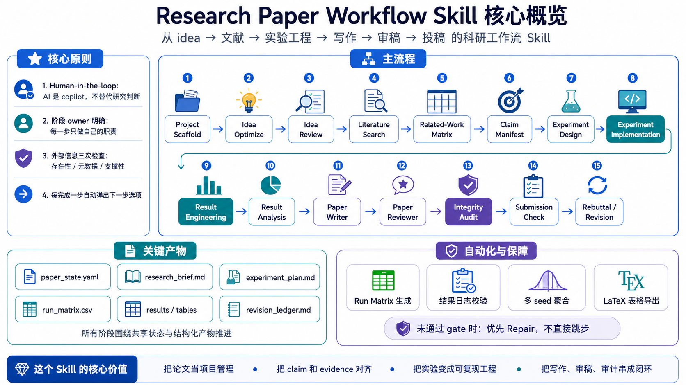

# Research Paper Workflow Skill

[中文](README.md) | English (current)

[](https://opensource.org/licenses/MIT)
[](https://claude.ai/code)
[](https://chatgpt.com)
[](https://cursor.com)

`research-paper-workflow` is an end-to-end research workflow skill for CS, AI, AI4Science, machine learning, agent, and systems papers. It is not designed to generate a paper in one shot. Instead, it treats a paper as a staged, auditable, human-in-the-loop research project: idea formation, literature search, claim design, experiment design, research engineering, result aggregation, manuscript writing, simulated review, integrity audit, submission check, and rebuttal.

It is especially useful for AAAI, NeurIPS, ICLR, CVPR, ACL, GECCO, and CCF-A-style projects where novelty, non-trivial insight, strong baselines, ablations, reproducibility, and evidence-backed claims matter.

---

## 1. What problem does this Skill solve?

Many research projects fail not because the writing is weak, but because the workflow is uncontrolled:

- the idea was never pressure-tested for novelty and insight;
- related work becomes a pile of summaries rather than a mechanism-level taxonomy;
- strong claims are made without matching experiments or citations;
- experiment design is not translated into runnable code, configs, run matrices, logs, and aggregation scripts;
- results are manually copied into tables without seed, commit, config, or provenance tracking;
- writing, review, audit, submission checking, and rebuttal are mixed together;
- external facts such as citations, benchmarks, datasets, repositories, venue rules, and deadlines are not strictly verified.

This Skill separates these concerns into explicit stages and gives a next-step menu after each completed step.

---

## 2. Core principles

1. **A paper is a research storyline, not a text-generation task**  
   Every stage follows: problem → gap → root challenge → insight → method → evidence → limitation → reviewer response.

2. **The user is the PI; AI is the copilot**  
   The user owns research questions, real results, authorship, and submission decisions. The Skill supports structure, drafting, checking, and risk exposure.

3. **Each mode has a clear owner boundary**  
   The writing mode does not verify facts; the reviewer mode does not rewrite the manuscript directly; the experiment-design mode does not invent results; the rebuttal mode does not promise experiments that were not done.

4. **Every major claim must connect to evidence**  
   A claim must map to a citation, result, proof, design rationale, or explicit placeholder.

5. **External information must be triple-checked**  
   Any stage that uses external facts must perform:
   - existence check: confirm that the source exists;
   - metadata check: confirm title, authors, date, version, venue, URL/DOI/arXiv/repository path;
   - support check: confirm that the source actually supports the claim.

6. **Every completed stage ends with a next-step menu**  
   The Skill appends `Next-step options` and marks one option as `[Recommended]` or `[Repair first]`.

---

## 3. Directory structure

```text
research-paper-workflow/
├── README.md                          ← GitHub entry point (Chinese), full documentation
├── README_zh.md                       ← Chinese README
├── README_en.md                       ← English README (this file)
├── SKILL.md                           ← index and router for all 16 skills
│
├── rpw-common/SKILL.md                ← shared governance: routing, verification, artifacts, state
├── rpw-pipeline/SKILL.md              ← project scaffold: init ccfa.yaml, plan stages, set gates
├── rpw-idea-optimize/SKILL.md         ← idea optimization: vague → falsifiable research story
├── rpw-idea-review/SKILL.md           ← idea review: strict scoring of novelty/feasibility/venue fit
├── rpw-literature-monitor/SKILL.md    ← literature monitor: competitor tracking, scoop alerts
├── rpw-literature-search/SKILL.md     ← literature search: systematic review + mechanism matrix + gaps
├── rpw-claim-manifest/SKILL.md        ← claim design: map each claim → required evidence
├── rpw-experiment-design/SKILL.md     ← experiment design: baselines, metrics, ablations, statistics
├── rpw-experiment-implementation/SKILL.md ← implementation: repo layout, configs, run matrix, logging
├── rpw-result-engineering/SKILL.md    ← result engineering: log validation, aggregation, LaTeX tables
├── rpw-result-analysis/SKILL.md       ← result analysis: results → claim support + limitations
├── rpw-paper-writer/SKILL.md          ← paper writer: draft, polish, compress, preserve format
├── rpw-paper-reviewer/SKILL.md        ← paper reviewer: multi-reviewer panel + AC/meta-review
├── rpw-integrity-audit/SKILL.md       ← integrity audit: claim/citation/number/figure consistency
├── rpw-submission-check/SKILL.md      ← submission check: pages, anonymity, PDF metadata, artifacts
├── rpw-rebuttal/SKILL.md              ← rebuttal: point-by-point response, revision ledger, resubmission
│
├── CLAUDE.md                          ← Claude Code local execution conventions + script usage
├── AGENT_GUIDE.md                     ← AI agent routing guide (mode table, artifacts, gates, shortcuts)
├── CHANGELOG.md                       ← version history
├── README_claude_code.md              ← Claude Code quick-start guide
├── LICENSE                            ← MIT license
├── .gitignore                         ← ignores Python cache, OS junk, user paper artifacts
│
├── figures/
│   └── Workflow-Core.png              ← 14-stage workflow visualization
├── docs/
│   └── ARCHITECTURE.md                ← architecture: layers, data flow, gate system, extension points
│
├── .claude-plugin/
│   └── plugin.json                    ← Claude Code one-click install manifest
├── .codex-plugin/
│   └── plugin.json                    ← OpenAI Codex CLI one-click install manifest
├── agents/
│   └── openai.yaml                    ← ChatGPT Custom GPT interface metadata
│
├── examples/
│   ├── artifact_flow.md               ← artifact dependency chain (16 artifacts)
│   ├── claude_code_prompts.md          ← copyable Claude Code prompts
│   └── local_project_layout.md        ← recommended user project directory layout
│
├── references/                        ← shared reference files (loaded on demand by each skill)
│   ├── workflow.md                    ← complete stage gate definitions
│   ├── literature-review.md           ← search strategy + paper card format
│   ├── experiment-design.md           ← CS/AI experiment protocol (baselines/ablations/statistics)
│   ├── experiment-implementation.md   ← experiment engineering patterns
│   ├── research-engineering.md        ← research engineering best practices
│   ├── result-logging.md              ← result log schema + validation rules
│   ├── reproducibility-passport.md    ← reproducibility passport (env/data/code/results)
│   ├── writing-guide.md               ← writing standards and conventions
│   ├── review-rubric.md               ← review scoring criteria and dimensions
│   ├── routing-and-artifacts.md       ← skill routing rules + artifact ownership contract
│   ├── storyline-blueprint.md         ← research storyline framework (problem→gap→insight→method)
│   ├── venue-writing.md               ← venue-specific writing (NeurIPS/ICLR/AAAI etc.)
│   ├── section-modules.md             ← section-by-section writing guidance
│   ├── citation-integrity.md          ← citation integrity audit protocol
│   ├── rebuttal-revision.md           ← rebuttal strategy + revision workflow
│   ├── source-verification.md         ← triple-check protocol (existence/metadata/support)
│   └── next-step-menu.md              ← next-step menu contract (recommended/repair/shortcuts)
│
├── assets/                            ← shared templates (used when creating new artifacts)
│   ├── idea_brief_template.md         ← idea brief template
│   ├── paper_card_template.md         ← paper card template
│   ├── related_work_matrix_template.md ← related-work matrix template
│   ├── claim_manifest_template.md     ← claim manifest template
│   ├── experiment_plan_template.md    ← experiment plan template
│   ├── implementation_plan_template.md ← implementation plan template
│   ├── run_matrix_template.csv        ← run matrix template
│   ├── config_schema_template.yaml    ← config schema template
│   ├── logging_schema_template.json   ← logging schema template
│   ├── repo_structure_template.md     ← repo structure template
│   ├── baseline_checklist_template.md ← baseline checklist template
│   ├── reproducibility_passport_template.md ← reproducibility passport template
│   ├── paper_state_template.yaml      ← project state template
│   ├── reviewer_report_template.md    ← review report template
│   ├── revision_ledger_template.md    ← revision ledger template
│   ├── source_verification_log_template.md ← source verification log template
│   └── submission_checklist_template.md ← submission checklist template
│
└── scripts/                           ← shared utility scripts (Python stdlib, zero dependencies)
    ├── build_paper_matrix.py          ← paper cards → related-work matrix
    ├── check_claim_manifest.py        ← validate claim manifest completeness
    ├── validate_paper_state.py        ← validate ccfa.yaml fields and consistency
    ├── build_revision_ledger.py       ← reviewer comments → revision ledger
    ├── generate_run_matrix.py         ← expand experiment axes → reproducible run matrix
    ├── validate_result_logs.py        ← check log fields/duplicate runs/missing seeds/failures
    ├── aggregate_results.py           ← multi-seed aggregation → mean/std/count tables
    ├── make_latex_tables.py           ← CSV results → LaTeX tables
    ├── check_source_verification_log.py ← validate source log (triple-check completeness)
    └── requirements.txt               ← dependency note (stdlib only, no pip install needed)
```

---

## 4. Installation

This skill works across multiple AI coding agents. Choose your platform below.

### 4.1 Claude Code (recommended)

**Option A: Plugin marketplace**
```bash
# In Claude Code, register this repo as a marketplace
/plugin marketplace add Airjiannan05/research-paper-workflow-skill

# Then install
/plugin install research-paper-workflow@research-paper-workflow
```

**Option B: Manual copy — project-local** (only this project)
```bash
mkdir -p .claude/skills/research-paper-workflow
cp -r SKILL.md CLAUDE.md references/ assets/ scripts/ agents/ examples/ .claude/skills/research-paper-workflow/
```

**Option C: Manual copy — global** (all projects)
```bash
mkdir -p ~/.claude/skills/research-paper-workflow
cp -r SKILL.md CLAUDE.md references/ assets/ scripts/ agents/ examples/ ~/.claude/skills/research-paper-workflow/
```

**Option D: Git clone + symlink** (stay updated)
```bash
git clone https://github.com/Airjiannan05/research-paper-workflow-skill.git ~/research-paper-workflow-skill
ln -s ~/research-paper-workflow-skill ~/.claude/skills/research-paper-workflow
```

After installation, restart Claude Code. Verify with:
```
/list-skills
```
Or ask: *"What skills are available?"*

### 4.2 ChatGPT (Custom GPT)

1. Go to [chatgpt.com](https://chatgpt.com) → **Explore GPTs** → **+ Create**
2. Switch to the **Configure** tab
3. **Name**: `Research Paper Workflow`
4. **Instructions**: Copy the full content of `SKILL.md` into this field
5. **Knowledge**: Upload key reference files from `references/` (e.g., `source-verification.md`, `next-step-menu.md`, `experiment-design.md`)
6. Enable **Code Interpreter** (for running the bundled Python scripts)
7. **Conversation starters** (optional):
   - *"Start a new paper project on <topic>"*
   - *"Review this idea for novelty and feasibility"*
   - *"Design experiments for my claims"*
8. Save → **Only me** or **Share with link**

> ⚠️ ChatGPT cannot directly run the scripts or edit local files. The skill will guide you to run scripts manually and paste results back.

### 4.3 OpenAI Codex CLI

```bash
mkdir -p ~/.codex/skills/research-paper-workflow
cp -r SKILL.md references/ assets/ scripts/ agents/ examples/ ~/.codex/skills/research-paper-workflow/
```

### 4.4 Cursor / Windsurf / Other Agents

The Agent Skills format is an open standard. Place the skill folder in your agent's skills directory:

| Agent | Skills path |
|---|---|
| Cursor | `~/.cursor/skills/` |
| Windsurf | `~/.windsurf/skills/` |
| Gemini CLI | `~/.gemini/skills/` |
| GitHub Copilot | `~/.copilot/skills/` or `.github/skills/` |

All agents auto-discover skills from these directories. Restart the agent after installation.

---

## 5. Full workflow

```text
0. rpw-pipeline           → project scaffold + stage plan
1. rpw-idea-optimize      → idea → falsifiable research story
2. rpw-idea-review        → strict novelty/feasibility scoring
3. rpw-literature-monitor → competitor/scoop tracking
4. rpw-literature-search  → systematic related-work + matrix
5. rpw-claim-manifest     → claim → evidence mapping
6. rpw-experiment-design  → baselines, metrics, ablations
7. rpw-experiment-implementation → code, configs, run matrix
8. rpw-result-engineering → log validation, aggregation, tables
9. rpw-result-analysis    → interpret results → claims
10. rpw-paper-writer       → draft, polish, compress
11. rpw-paper-reviewer     → simulated reviewer panel + AC
12. rpw-integrity-audit    → claim/citation/number consistency
13. rpw-submission-check   → venue compliance
14. rpw-rebuttal           → reviewer response + revision ledger
```



You do not need to start from Stage 0 every time. If you already have a draft, experiment plan, result logs, or reviewer comments, you can jump directly to the relevant mode.

---

## 6. Mode guide

### Trigger Boundaries

Similar tasks must route to different modes. This is the most important governance rule: avoid one request triggering multiple skills.

| You want to | Use | Do NOT use |
|---|---|---|
| Shape a vague idea into a research plan, find rescue routes | `rpw-idea-optimize` | `rpw-idea-review` |
| Score, rank, or select among multiple ideas | `rpw-idea-review` | `rpw-idea-optimize` |
| Track new papers, competitors, arXiv/OpenReview updates | `rpw-literature-monitor` | `rpw-literature-search` |
| Search for related work, benchmarks, baselines, open gaps | `rpw-literature-search` | `rpw-integrity-audit` |
| Map claims to required evidence | `rpw-claim-manifest` | `rpw-experiment-design` |
| Verify that already-cited sources truly support claims | `rpw-integrity-audit` | `rpw-literature-search` |
| Design experiments, baselines, metrics, ablations | `rpw-experiment-design` | `rpw-paper-writer` |
| Turn experiment plan into code, configs, run matrix | `rpw-experiment-implementation` | `rpw-experiment-design` |
| Validate logs, aggregate seeds, generate tables | `rpw-result-engineering` | `rpw-paper-writer` |
| Interpret real results into supported claims | `rpw-result-analysis` | `rpw-paper-writer` |
| Draft, polish, compress, or rewrite paper text | `rpw-paper-writer` | `rpw-paper-reviewer` |
| Judge acceptance risk, simulate reviews | `rpw-paper-reviewer` | `rpw-paper-writer` |
| Check claim/citation/number/figure consistency | `rpw-integrity-audit` | `rpw-paper-reviewer` |
| Check page limits, anonymity, PDF metadata, artifacts | `rpw-submission-check` | `rpw-paper-writer` |
| Respond to reviewers, maintain revision ledger | `rpw-rebuttal` | `rpw-paper-reviewer` |
| Break down a project into stages with gates | `rpw-pipeline` | any single owner |

### `pipeline`

Initializes the paper project and produces a stage plan, artifact contract, gates, and next owner mode.

Best for: starting from a broad research direction.

Example:

```text
Use research-paper-workflow. My target is an AAAI-level paper on GP for image classification. Start with pipeline, initialize paper_state, and give me a staged plan.
```

---

### `idea-optimize`

Turns a vague idea into a falsifiable research brief.

Outputs: problem, gap, root challenge, key insight, method sketch, central claim, minimum viable experiment, novelty threats, and rescue routes.

Example:

```text
Enter idea-optimize mode. My idea is to use genetic programming to improve interpretable feature construction for image classification. Turn it into a top-conference-level research brief.
```

---

### `idea-review`

Reviews the idea like a strict reviewer. It evaluates novelty, non-triviality, insight, feasibility, and evidence path.

Example:

```text
Enter idea-review mode. Review this idea under AAAI / GECCO standards. Decide keep / modify / kill and list repair conditions.
```

---

### `literature-monitor`

Tracks recent competitors, scoop risk, arXiv/OpenReview updates, and conference activity.

Best for: checking whether a similar paper has recently appeared.

---

### `literature-search`

Performs systematic search for prior art, benchmarks, baselines, SOTA methods, and negative evidence. It produces paper cards, a taxonomy, and a gap map.

All load-bearing literature facts must pass triple-check verification.

Example:

```text
Enter literature-search mode. Search the web for GP for image classification, focusing on GP feature construction, deep features + GP, symbolic image classification, and recent competitors from the last three years. Generate paper cards and a related-work matrix.
```

---

### `related-work matrix`

Converts papers into a mechanism-level comparison table rather than a list of summaries.

Typical fields: paper, problem, input, representation, core mechanism, supervision/data, output, evaluation, strength, limitation, relation to our work, novelty threat.

---

### `claim-manifest`

Lists every major paper claim and specifies the evidence required to support it.

Fields: claim, type, required support, citation/result/proof source, strength, risk, falsifier, and status.

---

### `experiment-design`

Designs experiments: datasets, baselines, metrics, ablations, robustness tests, failure cases, efficiency analysis, statistical reliability, and table/figure plans.

Core rule: every experiment must serve a claim, and every major claim must have an evidence path.

---

### `experiment-implementation`

Turns the experiment plan into runnable research engineering tasks.

Outputs: repo structure, module boundaries, config schema, run_matrix.csv, command templates, logging schema, baseline checklist, acceptance tests, environment capture, and reproducibility passport.

Example:

```text
Enter experiment-implementation mode. Based on this experiment_plan, generate a repo structure, config schema, run_matrix.csv, command templates, logging schema, baseline checklist, and reproducibility passport. Hardware: AMD 7900XT 20GB, Windows, local-first.
```

---

### `result-engineering`

Validates experiment logs, aggregates multi-seed results, and generates paper-ready tables.

It checks duplicate run IDs, missing seeds, missing configs, missing commits, failed runs, baseline coverage, and claim-result coverage.

Outputs: result_audit.md, aggregated_results.csv, main_results.tex, ablation_results.tex, and missing_runs_report.md.

---

### `result-analysis`

Interprets real results in terms of claim support.

Outputs: main result interpretation, ablation interpretation, failure cases, variance notes, runtime/cost analysis, supported/partially supported/unsupported claims, and safe wording.

---

### `paper-writer`

Drafts or revises paper text, including title, abstract, introduction, related work, method, experiments, analysis, limitations, conclusion, and appendix.

Rules: do not fabricate citations or results. Use `[CITE]`, `[VERIFY]`, `[RESULT]`, `[FIGURE]`, or `TBD` when evidence is missing.

---

### `paper-reviewer`

Simulates a reviewer panel and AC/meta-review.

Outputs: Reviewer A/B/C/D, AC meta-review, major concerns, minor concerns, score-risk, repair roadmap, and recommended next owner.

---

### `integrity-audit`

Checks consistency across claims, citations, numbers, figures, tables, results, and text.

Outputs: claim-support table, citation-context support, numeric consistency report, figure/table/text consistency, unsupported claims, unsafe wording, and required fixes.

---

### `submission-check`

Checks whether the submission package is ready: venue rules, page limit, anonymization, PDF metadata, template compliance, references, appendix, artifact package, reproducibility checklist, and AI disclosure.

Current venue rules must be checked against official sources and triple-verified.

---

### `rebuttal`

Handles reviewer comments, point-by-point response, revision ledger, and resubmission strategy.

It does not promise experiments that were not completed. Every promised action must be marked as done, planned, pending, or cannot-do.

---

## 7. Next-step menu

After each stage, the Skill automatically outputs:

```text
Next-step options:
A. [Recommended] <next mode> — <purpose>. Best if: <condition>.
B. <alternative mode> — <purpose>. Best if: <condition>.
C. <alternative mode> — <purpose>. Best if: <condition>.
D. Pause / export — <save or summarize current artifact>.

Suggested next command: “Continue with A.”
```

You can reply with:

```text
A
Continue with A
next
repair
experiment-implementation
result-engineering
paper-reviewer
```

The Skill will execute the selected step directly.

---

## 8. Triple-check rule for external information

Any query-related stage must verify external information strictly.

1. **Existence check**  
   Does the source actually exist? Can the paper, dataset, benchmark, GitHub repository, or venue rule be found in a reliable source?

2. **Metadata check**  
   Are the title, authors, date, version, venue, URL, DOI, arXiv ID, repository path, and official/unofficial status correct?

3. **Support check**  
   Does the source actually support the claim being made? A similar title is not enough.

Verification status:

```text
verified   = all three checks passed
partial    = some checks passed, but gaps remain
unverified = cannot be confirmed
conflict   = sources disagree
```

Information that fails the triple-check process must not be used as load-bearing evidence.

---

## 9. Common usage paths

### Start a paper from scratch

```text
Use research-paper-workflow. My target is a top-conference paper on <your topic>. Start with pipeline + idea-optimize, initialize paper_state, and generate a research brief.
```

### Organize related work from existing papers

```text
Use literature-search / related-work matrix mode. Here is my paper list. Generate paper cards, a method taxonomy, a related-work matrix, and a gap synthesis.
```

### Turn an experiment plan into code tasks

```text
Use experiment-implementation mode. Based on this experiment_plan, generate repo structure, config schema, run_matrix.csv, command templates, logging schema, baseline checklist, and reproducibility passport.
```

### Process completed experiment results

```text
Use result-engineering mode. Here are runs.csv and run_matrix.csv. Check missing runs, failed runs, duplicate runs, seed coverage, provenance completeness, and generate mean/std aggregation and LaTeX tables.
```

### Audit a draft before submission

```text
Use paper-reviewer + integrity-audit. Review this paper under AAAI/NeurIPS/GECCO standards. Identify likely rejection reasons, missing experiments, overclaiming, citation problems, and the repair route.
```

---

## 10. Scripts

| Script | Purpose |
|---|---|
| `build_paper_matrix.py` | Build a related-work matrix from structured paper cards |
| `check_claim_manifest.py` | Check missing evidence / status / source fields in a claim manifest |
| `validate_paper_state.py` | Validate required fields in `paper_state.yaml` |
| `build_revision_ledger.py` | Build a revision ledger from reviewer comments in CSV/JSON |
| `generate_run_matrix.py` | Generate `run_matrix.csv` from experiment design parameters |
| `validate_result_logs.py` | Check result logs for missing fields, duplicate runs, missing seeds, and failed runs |
| `aggregate_results.py` | Aggregate multi-seed / multi-dataset / multi-baseline results |
| `make_latex_tables.py` | Convert result CSV files into LaTeX tables |
| `check_source_verification_log.py` | Check whether the source verification log completed existence / metadata / support checks |

---

## 11. Recommended first command

```text
Use research-paper-workflow.
My target is a top-conference paper on <your research topic>.
Start with project scaffold + idea-optimize:
1. initialize paper_state.yaml;
2. generate a research brief;
3. clarify the problem-gap-insight-method-evidence chain;
4. list novelty threats;
5. propose keywords and screening criteria for literature-search.
```

---

## 12. Notes and limitations

- This Skill does not guarantee acceptance at a top venue; it helps expose risks earlier.
- It must not fabricate experiment results, citations, venue rules, or reviewer opinions.
- If evidence is insufficient, it should downgrade the claim, request more experiments or citations, or mark `needs evidence`.
- Final submission decisions, authorship, ethics, data licensing, experimental truthfulness, and venue compliance must be manually verified by the user.
