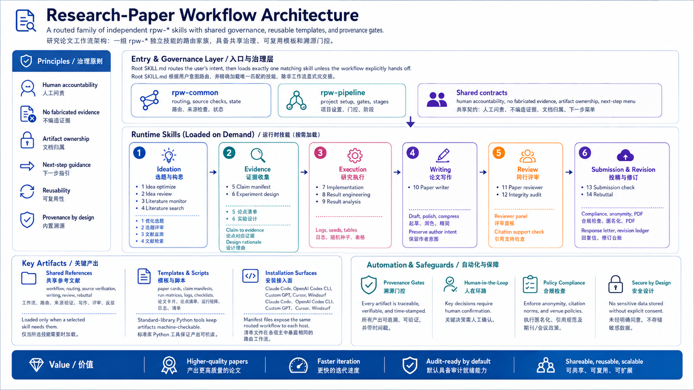
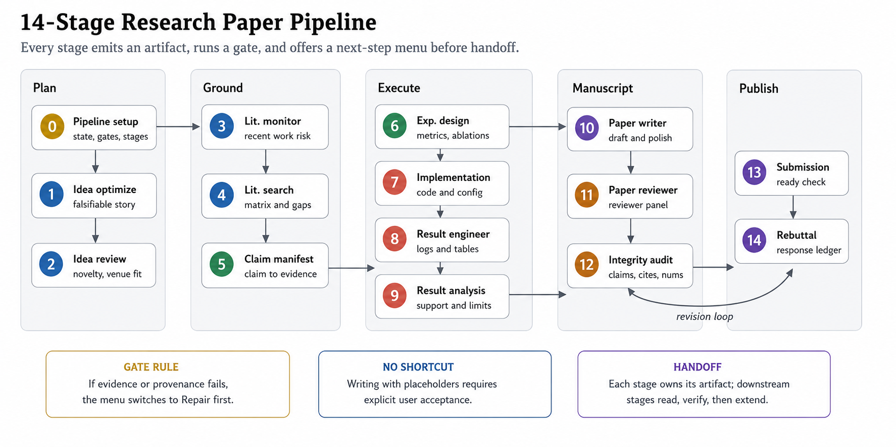
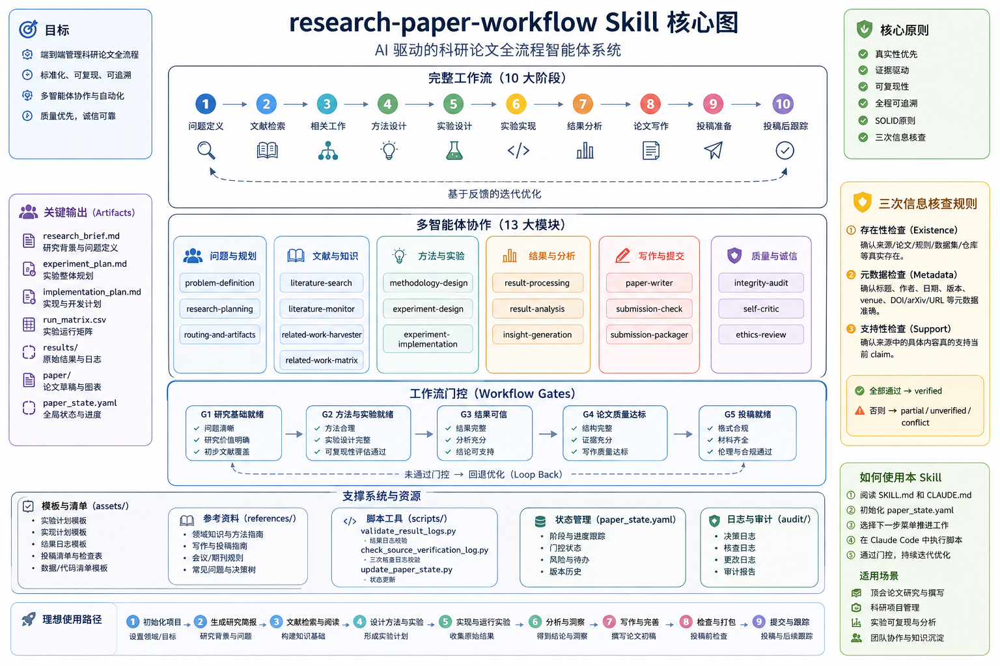
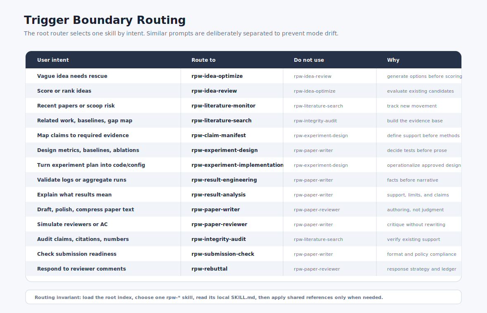

# Research Paper Workflow Skill

[English version](README_en.md) | 中文（当前）

[](https://opensource.org/licenses/MIT)
[](https://claude.ai/code)
[](https://chatgpt.com)
[](https://cursor.com)

`research-paper-workflow` 是一个面向 CS / AI / AI4Science / 机器学习 / Agent / 系统方向论文的全流程科研工作流 Skill。它的目标不是“一次性帮你生成一篇论文”，而是把一篇顶会论文拆成可推进、可检查、可回滚的阶段：从 idea、文献、claim、实验设计，到实验工程实现、结果聚合、论文写作、审稿模拟、完整性审计、投稿检查和 rebuttal。

它特别适合 AAAI、NeurIPS、ICLR、CVPR、ACL、GECCO、CCF-A 风格的研究项目，强调 novelty、non-trivial insight、强 baseline、消融实验、可复现性、claim-to-evidence 映射和人类在环决策。

---

## 快速开始

```bash
# 1. 克隆仓库
git clone https://github.com/Airjiannan05/research-paper-workflow-skill.git

# 2. 安装到 Claude Code（全局生效）
mkdir -p ~/.claude/skills && cp -r research-paper-workflow-skill ~/.claude/skills/

# 3. 重启 Claude Code，然后直接说：
"帮我开始一个新的论文项目，方向是 XXX，目标投 NeurIPS"
```

> 首次使用会自动加载 `rpw-idea-optimize` 进入 idea 优化阶段。每个阶段结束都会给出下一步选项。详见 [§4 安装方式](#4-安装方式)。

---

## 目录

1. [这个 Skill 解决什么问题？](#1-这个-skill-解决什么问题)
2. [核心原则](#2-核心原则)
3. [目录结构](#3-目录结构)
4. [安装方式](#4-安装方式)
5. [完整工作流](#5-完整工作流)
6. [模块功能说明](#6-模块功能说明)（含[触发边界表](#触发边界)）
7. [下一步菜单机制](#7-下一步菜单机制)
8. [外部信息三次检查规则](#8-外部信息三次检查规则)
9. [典型使用路径](#9-典型使用路径)
10. [脚本工具](#10-脚本工具)
11. [推荐启动命令](#11-推荐启动命令)
12. [注意事项](#12-注意事项)

---

## 1. 这个 Skill 解决什么问题？

很多论文项目失败不是因为不会写，而是因为流程失控：

- idea 没有被严格卡 novelty 和 insight；
- related work 只是堆摘要，没有形成 mechanism-level taxonomy；
- claim 写得很强，但没有对应实验或引用支持；
- 实验设计完成后，代码工程、run matrix、日志和结果聚合没有规范；
- 结果被手工复制进表格，缺少 seed、commit、config、provenance；
- 写作、评审、审计、投稿检查混在一起，导致 AI 过度美化或编造证据；
- 引用、benchmark、venue rule、dataset、GitHub 仓库等外部信息没有严格验证。

这个 Skill 把这些步骤拆成明确模块，并要求每一步完成后给出下一步选项。

---

## 2. 核心原则

1. **论文是 research storyline，不是文本生成任务**  
   所有内容都围绕：problem → gap → root challenge → insight → method → evidence → limitation → reviewer response。

2. **人类是 PI，AI 是 copilot**  
   用户负责真实研究问题、真实实验结果、作者贡献、投稿决定；Skill 负责流程化、整理、检查、草稿和风险暴露。

3. **每个模块有明确 owner**  
   写作模块不负责审计事实；审稿模块不直接改正文；实验设计模块不编造结果；rebuttal 模块不承诺未完成实验。

4. **所有重要 claim 必须连接证据**  
   claim 必须对应 citation、result、proof、design rationale 或明确 placeholder。

5. **外部信息必须三次检查**  
   任何涉及文献、引用、benchmark、dataset、仓库、工具版本、venue rule、deadline 等外部信息的环节，都必须执行：
   - existence check：确认来源真实存在；
   - metadata check：确认标题、作者、日期、版本、venue、URL/DOI/arXiv/repo path 等；
   - support check：确认来源内容真的支持当前 claim。

6. **每完成一步都弹出下一步菜单**  
   Skill 会在每个阶段末尾给出 `Next-step options`，并标记一个 `[Recommended]` 或 `[Repair first]`。

---



## 3. 目录结构

```text
research-paper-workflow/
├── README.md                          ← GitHub 首页展示（中文），含完整使用文档
├── README_zh.md                       ← 中文版 README
├── README_en.md                       ← 英文版 README
├── SKILL.md                           ← 16 个 skill 的索引与路由入口
│
├── rpw-common/SKILL.md                ← 共享治理：路由规则、来源验证、产物归属、状态管理
├── rpw-pipeline/SKILL.md              ← 项目搭建：初始化 paper_state.yaml、拆阶段、设 gate
├── rpw-idea-optimize/SKILL.md         ← idea 优化：模糊方向 → 可证伪研究故事
├── rpw-idea-review/SKILL.md           ← idea 评审：严格打分 novelty/可行性/venue fit
├── rpw-literature-monitor/SKILL.md    ← 文献监控：竞品追踪、scoop 预警、arXiv 动态
├── rpw-literature-search/SKILL.md     ← 文献检索：系统搜索 related work + 机制矩阵 + gap 分析
├── rpw-claim-manifest/SKILL.md        ← claim 设计：每个 claim → 所需证据映射
├── rpw-experiment-design/SKILL.md     ← 实验设计：baseline、metric、消融、鲁棒性、统计
├── rpw-experiment-implementation/SKILL.md ← 实验实现：仓库结构、config、run matrix、日志
├── rpw-result-engineering/SKILL.md    ← 结果工程：日志验证、多 seed 聚合、LaTeX 表格生成
├── rpw-result-analysis/SKILL.md       ← 结果分析：实验结果 → claim 支持判断 + 局限性
├── rpw-paper-writer/SKILL.md          ← 论文写作：起草、润色、压缩、保留原始格式
├── rpw-paper-reviewer/SKILL.md        ← 审稿模拟：多 reviewer 面板 + AC/meta-review
├── rpw-integrity-audit/SKILL.md       ← 完整性审计：claim/引用/数字/图表一致性检查
├── rpw-submission-check/SKILL.md      ← 投稿检查：页数、匿名、PDF 元数据、artifact
├── rpw-rebuttal/SKILL.md              ← rebuttal：逐条回复、revision ledger、重投策略
│
├── CLAUDE.md                          ← Claude Code 本地执行约定与脚本用法
├── AGENT_GUIDE.md                     ← AI agent 路由指南（模式路由表、产物归属、gate 行为）
├── CHANGELOG.md                       ← 版本变更历史
├── README_claude_code.md              ← Claude Code 用户快速入门
├── LICENSE                            ← MIT 开源协议
├── .gitignore                         ← 忽略 Python 缓存、系统垃圾、用户论文产物
│
├── figures/
│   ├── architecture.svg               ← 16 skill 家族架构总览
│   ├── workflow.svg                   ← 14 阶段流水线
│   ├── routing.svg                    ← 触发边界路由图
│   ├── artifact-flow.svg              ← 产物流转依赖链
│   └── Workflow-Core.png              ← 工作流核心示意图
├── docs/
│   └── ARCHITECTURE.md                ← 架构设计文档：分层图、数据流、gate 系统、扩展点
│
├── .claude-plugin/
│   └── plugin.json                    ← Claude Code 一键安装配置
├── .codex-plugin/
│   └── plugin.json                    ← OpenAI Codex CLI 一键安装配置
├── agents/
│   └── openai.yaml                    ← ChatGPT Custom GPT 接口元数据
│
├── examples/
│   ├── artifact_flow.md               ← 产物流转关系图（16 个 artifact 的依赖链）
│   ├── claude_code_prompts.md          ← Claude Code 常用 prompt 示例
│   └── local_project_layout.md        ← 推荐的用户论文项目目录结构
│
├── references/                        ← 共享参考文件（各 skill 按需加载）
│   ├── workflow.md                    ← 完整阶段 gate 定义
│   ├── literature-review.md           ← 文献检索策略与 paper card 格式
│   ├── experiment-design.md           ← CS/AI 实验设计协议（baseline/消融/统计）
│   ├── experiment-implementation.md   ← 实验工程实现模式
│   ├── research-engineering.md        ← 研究工程最佳实践
│   ├── result-logging.md              ← 结果日志规范与验证规则
│   ├── reproducibility-passport.md    ← 可复现性护照（环境/数据/代码/结果）
│   ├── writing-guide.md               ← 论文写作规范与约定
│   ├── review-rubric.md               ← 审稿评分标准与维度
│   ├── routing-and-artifacts.md       ← skill 路由规则与产物归属合约
│   ├── storyline-blueprint.md         ← 研究故事线框架（problem→gap→insight→method）
│   ├── venue-writing.md               ← 会议特化写作（NeurIPS/ICLR/AAAI 等）
│   ├── section-modules.md             ← 论文章节模块化指南
│   ├── citation-integrity.md          ← 引用完整性审计协议
│   ├── rebuttal-revision.md           ← rebuttal 策略与 revision 工作流
│   ├── source-verification.md         ← 三重来源验证协议（存在/元数据/支撑）
│   └── next-step-menu.md              ← 下一步菜单合约（推荐/修复/快捷命令）
│
├── assets/                            ← 共享模板（创建新产物时使用）
│   ├── idea_brief_template.md         ← idea brief 模板
│   ├── paper_card_template.md         ← 文献卡片模板
│   ├── related_work_matrix_template.md ← 相关工作矩阵模板
│   ├── claim_manifest_template.md     ← claim 清单模板
│   ├── experiment_plan_template.md    ← 实验计划模板
│   ├── implementation_plan_template.md ← 实现计划模板
│   ├── run_matrix_template.csv        ← 运行矩阵模板
│   ├── config_schema_template.yaml    ← 配置文件模板
│   ├── logging_schema_template.json   ← 日志 schema 模板
│   ├── repo_structure_template.md     ← 仓库结构模板
│   ├── baseline_checklist_template.md ← 基线实现清单模板
│   ├── reproducibility_passport_template.md ← 可复现护照模板
│   ├── paper_state_template.yaml      ← 项目状态文件模板
│   ├── reviewer_report_template.md    ← 审稿报告模板
│   ├── revision_ledger_template.md    ← 修订台账模板
│   ├── source_verification_log_template.md ← 来源验证日志模板
│   └── submission_checklist_template.md ← 投稿检查清单模板
│
└── scripts/                           ← 共享工具脚本（Python 标准库，零依赖）
    ├── build_paper_matrix.py          ← 从 paper cards 生成 related-work 矩阵
    ├── check_claim_manifest.py        ← 验证 claim manifest 完整性
    ├── validate_paper_state.py        ← 验证 paper_state.yaml 字段与一致性
    ├── build_revision_ledger.py       ← 从 reviewer 评论生成 revision ledger
    ├── generate_run_matrix.py         ← 展开实验轴为可复现 run matrix
    ├── validate_result_logs.py        ← 检查日志字段/重复 run/缺失 seed/失败 run
    ├── aggregate_results.py           ← 多 seed 聚合为 mean/std/count 表
    ├── make_latex_tables.py           ← CSV 结果转 LaTeX 表格
    ├── check_source_verification_log.py ← 结构验证来源日志（三次检查完整性）
    └── requirements.txt               ← 依赖说明（纯标准库，无需 pip install）
```

---

## 4. 安装方式

本 Skill 兼容多种 AI 编程助手，选择你的平台即可。

### 4.1 Claude Code（推荐）

**方式 0：直接叫 Claude 安装**
```bash
直接帮我安装这个skill: https://github.com/Airjiannan05/research-paper-workflow-skill.git
```

**方式 A：插件市场安装** ⚠️ 实验性
```bash
# 在 Claude Code 中注册本仓库为 marketplace
/plugin marketplace add Airjiannan05/research-paper-workflow-skill

# 安装
/plugin install research-paper-workflow@research-paper-workflow
```
> 插件市场功能可能因 Claude Code 版本而异。如失败，使用方式 B/C/D。

**方式 B：手动复制 — 项目级**（仅当前项目生效）
```bash
mkdir -p .claude/skills/research-paper-workflow
cp -r SKILL.md CLAUDE.md references/ assets/ scripts/ agents/ examples/ .claude/skills/research-paper-workflow/
```

**方式 C：手动复制 — 全局**（所有项目生效）
```bash
mkdir -p ~/.claude/skills/research-paper-workflow
cp -r SKILL.md CLAUDE.md references/ assets/ scripts/ agents/ examples/ ~/.claude/skills/research-paper-workflow/
```

**方式 D：Git clone + 软链接**（方便后续更新）
```bash
git clone https://github.com/Airjiannan05/research-paper-workflow-skill.git ~/research-paper-workflow-skill
ln -s ~/research-paper-workflow-skill ~/.claude/skills/research-paper-workflow
```

安装完成后重启 Claude Code，验证：
```
/list-skills
```
或者直接问：*"有哪些可用的 skills？"*

### 4.2 ChatGPT（Custom GPT）

1. 打开 [chatgpt.com](https://chatgpt.com) → **探索 GPT** → **+ 创建**
2. 切换到 **配置** 选项卡
3. **名称**：`Research Paper Workflow`
4. **指令**：将 `SKILL.md` 的完整内容复制到此处
5. **知识库**：上传 `references/` 目录下的核心参考文件（如 `source-verification.md`、`next-step-menu.md`、`experiment-design.md`）
6. 开启 **代码解释器**（用于运行内置 Python 脚本）
7. **对话开场白**（可选）：
   - *"帮我开始一个新的论文项目，方向是……"*
   - *"评审一下这个 idea 的 novelty 和可行性"*
   - *"为我的 claims 设计实验"*
8. 保存 → **仅自己** 或 **分享链接**

> ⚠️ ChatGPT 无法直接运行脚本或编辑本地文件。Skill 会引导你手动运行脚本并将结果粘贴回对话。

### 4.3 兼容性分级

| 级别 | 平台 | 说明 |
|---|---|---|
| ✅ 已测试 | Claude Code（手动安装） | 方式 B/C/D 已验证可用 |
| ✅ 已测试 | GitHub 本地使用 | 直接作为项目 skill 目录加载 |
| 🟡 大概率兼容 | ChatGPT Custom GPT | 上传 SKILL.md + references 作为知识库 |
| 🔬 实验性 | OpenAI Codex CLI | Agent Skills 开放标准，需验证 |
| 🔬 实验性 | Cursor / Windsurf / Gemini CLI / GitHub Copilot | 理论上支持 Agent Skills 标准目录结构 |
| ❓ 未知 | Claude Code 插件市场 | `/plugin marketplace` 命令因版本而异 |

> 安装方式：将 skill 文件夹复制到对应 agent 的 skills 目录（如 `~/.cursor/skills/`、`~/.windsurf/skills/`），重启 agent 后测试。

---

## 5. 完整工作流

```text
0. rpw-pipeline           → 项目搭建 + 阶段规划
1. rpw-idea-optimize      → idea → 可证伪研究故事
2. rpw-idea-review        → 严格 novelty/可行性 评分
3. rpw-literature-monitor → 竞品/ scoop 追踪
4. rpw-literature-search  → 系统性 related-work + matrix
5. rpw-claim-manifest     → claim → 证据映射
6. rpw-experiment-design  → baseline、metric、消融
7. rpw-experiment-implementation → 代码、config、run matrix
8. rpw-result-engineering → 日志验证、聚合、表格
9. rpw-result-analysis    → 结果 → claim 支持判断
10. rpw-paper-writer       → 起草、润色、压缩
11. rpw-paper-reviewer     → 模拟审稿 + AC
12. rpw-integrity-audit    → claim/引用/数字一致性
13. rpw-submission-check   → 投稿合规检查
14. rpw-rebuttal           → 审稿回复 + revision ledger
```





你不需要每次从第 0 步开始。可以根据已有材料直接跳到任意阶段。

---

## 6. 模块功能说明

### 触发边界



相似的任务必须进入不同的模式，避免同时触发多个 skill。

| 你要做的事 | 使用 | 不要使用 |
|---|---|---|
| 把模糊 idea 变成可做的研究方案、找救援路线 | `rpw-idea-optimize` | `rpw-idea-review` |
| 对多个 idea 打分、排序、取舍 | `rpw-idea-review` | `rpw-idea-optimize` |
| 追踪新论文、竞品、arXiv/OpenReview 动态 | `rpw-literature-monitor` | `rpw-literature-search` |
| 系统性搜索 related work、benchmark、baseline | `rpw-literature-search` | `rpw-integrity-audit` |
| 把 claim 映射到所需证据 | `rpw-claim-manifest` | `rpw-experiment-design` |
| 核验论文里已引用的文献是否真的支持 claim | `rpw-integrity-audit` | `rpw-literature-search` |
| 设计实验、baseline、metric、消融 | `rpw-experiment-design` | `rpw-paper-writer` |
| 把实验设计落地为代码工程、config、run matrix | `rpw-experiment-implementation` | `rpw-experiment-design` |
| 验证实验日志、聚合多 seed 结果、生成表格 | `rpw-result-engineering` | `rpw-paper-writer` |
| 把真实结果解释为 claim 支持情况 | `rpw-result-analysis` | `rpw-paper-writer` |
| 写正文、润色、压缩、保持原格式改写 | `rpw-paper-writer` | `rpw-paper-reviewer` |
| 判断论文能否被接收、哪里会被拒 | `rpw-paper-reviewer` | `rpw-paper-writer` |
| 检查 claim/引用/数字/图表一致性 | `rpw-integrity-audit` | `rpw-paper-reviewer` |
| 检查页数、匿名、PDF metadata、artifact | `rpw-submission-check` | `rpw-paper-writer` |
| 回复审稿人、维护 revision ledger | `rpw-rebuttal` | `rpw-paper-reviewer` |
| 拆任务、排阶段、设 gate | `rpw-pipeline` | 任何单一 owner |

### `pipeline`

初始化论文项目，生成阶段计划、artifact contract、gate 和下一步 owner。

适合：你只有一个方向，想把它拆成完整论文推进计划。

示例：

```text
使用 research-paper-workflow。我的目标是做一篇 AAAI 级别论文，方向是 GP for image classification。请从 pipeline 开始，初始化 paper_state，并给出阶段计划。
```

---

### `idea-optimize`

把模糊 idea 变成可证伪的 research brief。

输出包括：problem、gap、root challenge、key insight、method sketch、central claim、minimum viable experiment、novelty threats、rescue routes。

示例：

```text
进入 idea-optimize 模式。我的 idea 是：用 GP 改进图像分类中的可解释特征构造。请把它整理成顶会论文级 research brief。
```

---

### `idea-review`

像严格 reviewer 一样评审 idea，判断 novelty、non-triviality、insight、feasibility 和 evidence path。

示例：

```text
进入 idea-review 模式。请按 AAAI / GECCO 顶会标准评审这个 idea，判断 keep / modify / kill，并给出 repair conditions。
```

---

### `literature-monitor`

监控近期竞品、scoop 风险、OpenReview/arXiv/会议动态。

适合：你担心别人已经做了类似工作，或者需要最新相关论文。

---

### `literature-search`

系统性搜索 prior art、benchmark、baseline、SOTA 和反例证据，并生成 paper cards、taxonomy 和 gap map。

所有 load-bearing 文献信息都必须经过三次检查。

示例：

```text
进入 literature-search 模式。联网搜索 GP for image classification 的相关工作，重点找 GP feature construction、deep feature + GP、symbolic image classification 和近三年竞品。请生成 paper cards 和 related-work matrix。
```

---

### `related-work matrix`

把文献整理成机制对比表，而不是普通摘要堆。

常用字段：paper、problem、input、representation、core mechanism、supervision/data、output、evaluation、strength、limitation、relation to our work、novelty threat。

---

### `claim-manifest`

把论文的每个 claim 显式列出来，并标注需要什么证据。

示例字段：claim、type、required support、citation/result/proof source、strength、risk、falsifier、status。

---

### `experiment-design`

设计实验：dataset、baseline、metric、ablation、robustness、failure case、efficiency、统计可靠性、表格和图规划。

核心规则：每个实验必须服务某个 claim，每个 claim 必须有证据路径。

---

### `experiment-implementation`

把实验设计转成可运行工程。

输出包括：repo structure、module boundaries、config schema、run_matrix.csv、command templates、logging schema、baseline checklist、acceptance tests、environment capture、reproducibility passport。

示例：

```text
进入 experiment-implementation 模式。基于这个 experiment_plan，帮我生成 repo 结构、config schema、run_matrix.csv、命令模板、logging schema、baseline checklist 和 reproducibility passport。硬件是 AMD 7900XT 20GB，Windows，本地优先。
```

---

### `result-engineering`

检查实验日志，聚合多 seed 结果，生成论文表格。

检查内容包括：重复 run、缺失 seed、缺失 config、缺失 commit、failed runs、baseline 是否跑齐、claim 是否有结果支持。

输出包括：result_audit.md、aggregated_results.csv、main_results.tex、ablation_results.tex、missing_runs_report.md。

---

### `result-analysis`

把真实结果解释为论文 claim 支持情况。

输出包括：main result interpretation、ablation interpretation、failure cases、variance notes、runtime/cost analysis、supported/partially supported/unsupported claims、safe wording。

---

### `paper-writer`

生成或修改论文正文，包括 title、abstract、introduction、related work、method、experiments、analysis、limitations、conclusion、appendix。

规则：不编造 citation、不编造实验结果；没有证据的地方标记 `[CITE]`、`[VERIFY]`、`[RESULT]`、`[FIGURE]`、`TBD`。

---

### `paper-reviewer`

模拟 reviewer panel 和 AC/meta-review。

输出包括：Reviewer A/B/C/D、AC meta-review、major concerns、minor concerns、score-risk、repair roadmap、recommended next owner。

---

### `integrity-audit`

检查 claim、citation、数字、图表、结果和文本是否一致。

输出包括：claim-support table、citation-context support、numeric consistency report、figure/table/text consistency、unsupported claims、unsafe wording、required fixes。

---

### `submission-check`

检查投稿包是否 ready：venue rules、page limit、anonymity、PDF metadata、template compliance、references、appendix、artifact package、reproducibility checklist、AI disclosure。

涉及当前会议规则时，必须联网查询官方来源并进行三次检查。

---

### `rebuttal`

处理 reviewer comments、point-by-point response、revision ledger 和 resubmission strategy。

不会承诺未完成的新实验；所有承诺必须标记为 done、planned、pending 或 cannot-do。

---

## 7. 下一步菜单机制

每个阶段完成后，Skill 会自动输出：

```text
Next-step options:
A. [Recommended] <next mode> — <purpose>. Best if: <condition>.
B. <alternative mode> — <purpose>. Best if: <condition>.
C. <alternative mode> — <purpose>. Best if: <condition>.
D. Pause / export — <save or summarize current artifact>.

Suggested next command: “Continue with A.”
```

你可以直接回复：

```text
A
继续 A
next
repair
experiment-implementation
result-engineering
paper-reviewer
```

Skill 会直接执行对应下一步，不会再问开放式问题。

---

## 8. 外部信息三次检查规则

所有和查询信息有关的环节都必须严格验证。三次检查如下：

1. **Existence check**  
   来源是否真实存在？论文、数据集、benchmark、GitHub 仓库、venue rule 是否能在可靠来源中找到？

2. **Metadata check**  
   标题、作者、日期、版本、venue、URL、DOI、arXiv ID、repo path、官方/非官方状态是否正确？

3. **Support check**  
   来源中的具体内容是否真的支持当前 claim？不能只因为论文标题相似就当作证据。

验证状态：

```text
verified   = 三项都通过
partial    = 部分通过，但仍有缺口
unverified = 无法确认
conflict   = 来源之间冲突
```

未通过三次检查的信息不能作为 load-bearing evidence 使用。

---

## 9. 典型使用路径

### 从零开始做一篇论文

```text
使用 research-paper-workflow。我的目标是做一篇 AAAI/顶会级论文，方向是 <你的方向>。请从 pipeline + idea-optimize 开始，初始化 paper_state，并生成 research brief。
```

### 已经有文献，想整理 related work

```text
使用 literature-search / related-work matrix 模式。下面是我已有的论文列表，请生成 paper cards、method taxonomy、related-work matrix 和 gap synthesis。
```

### 已经有实验设计，想落地工程

```text
使用 experiment-implementation 模式。基于这个 experiment_plan，生成 repo structure、config schema、run_matrix.csv、command templates、logging schema、baseline checklist 和 reproducibility passport。
```

### 已经跑完实验，想整理结果

```text
使用 result-engineering 模式。这是 runs.csv 和 run_matrix.csv，请检查缺失 run、失败 run、重复 run、seed 覆盖、provenance 完整性，并生成 mean/std 聚合表和 LaTeX 表格。
```

### 已经有草稿，想冲顶会

```text
使用 paper-reviewer + integrity-audit。请按 AAAI/NeurIPS/GECCO 顶会标准检查这篇论文最可能被拒的原因、缺失实验、过强 claim、引用问题和修复路线。
```

---

## 10. 脚本工具

| 脚本 | 功能 |
|---|---|
| `build_paper_matrix.py` | 从结构化 paper cards 生成 related-work matrix |
| `check_claim_manifest.py` | 检查 claim manifest 是否缺 evidence / status / source |
| `validate_paper_state.py` | 检查 `paper_state.yaml` 字段是否完整 |
| `build_revision_ledger.py` | 从 reviewer comments CSV/JSON 生成 revision ledger |
| `generate_run_matrix.py` | 从实验设计参数生成 `run_matrix.csv` |
| `validate_result_logs.py` | 检查实验日志字段、重复 run、缺失 seed、失败 run |
| `aggregate_results.py` | 聚合多 seed / 多 dataset / 多 baseline 结果 |
| `make_latex_tables.py` | 把结果 CSV 转成 LaTeX 表格 |
| `check_source_verification_log.py` | 检查 source verification log 是否完成 existence / metadata / support 三次检查 |

---

## 11. 推荐启动命令

```text
使用 research-paper-workflow。
我的目标是做一篇 AAAI/顶会级论文，方向是 <你的研究方向>。
请从 project scaffold + idea-optimize 开始：
1. 初始化 paper_state.yaml
2. 生成 research brief
3. 明确 problem-gap-insight-method-evidence 链条
4. 给出 novelty threats
5. 给出下一步 literature-search 的关键词和筛选标准
```

---

## 12. 注意事项

- 这个 Skill 不会替用户保证论文一定可发顶会；它会更早暴露风险。
- 它不会编造实验结果、引用、venue rule 或 reviewer 意见。
- 如果证据不足，它会要求降调 claim、补实验、补引用或标记 `needs evidence`。
- 所有最终投稿、作者贡献、伦理、数据许可、实验真实性和会议规则都需要用户人工确认。
